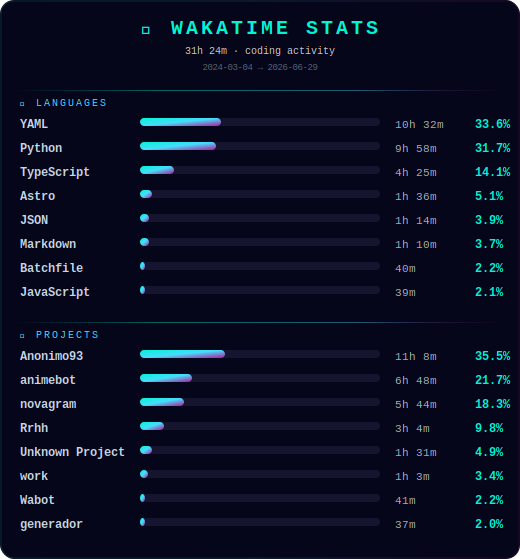

<h1 align="center">Hi there 👋, I'm Zaydier Torres</h1>
<h3 align="center">Fullstack Developer · React · Node.js · TypeScript · Flutter · Kotlin</h3>

  
  
  

---

## 🚀 About Me

Fullstack Developer with **4+ years** building production web and mobile applications. I specialize in:

- **Frontend:** React · Next.js · TypeScript · TailwindCSS · Responsive UI
- **Backend:** Node.js · REST APIs · Python · PostgreSQL · ORMs
- **Mobile:** Flutter · Kotlin · Android Development
- **Automation:** Telegram Bots · Python Scripting · CI/CD

> Background in Accounting & Finance gives me an analytical edge — I approach software with the same rigor I applied to financial systems.

📍 Camagüey, Cuba · ✉️ siriusdev984@gmail.com · 💼 Open to remote opportunities

---

## 🛠️ Tech Stack

### Frontend

### Backend

### Mobile

### Tools

---

## 📊 GitHub Analytics

  
  

  

  

---

## 🐍 Contribution Graph

---

## 📌 Pinned Projects

<table>
  <tr>
    <td><b>🔒 Project 1</b></td>
    <td>Fullstack app with React + Node.js + PostgreSQL — [add description]</td>
  </tr>
  <tr>
    <td><b>🔒 Project 2</b></td>
    <td>Mobile app built with Flutter/Kotlin — [add description]</td>
  </tr>
  <tr>
    <td><b>🔒 Project 3</b></td>
    <td>Telegram bot / Automation tool — [add description]</td>
  </tr>
</table>

---

## 📈 Weekly Development Breakdown

<!--START_SECTION:waka-->

<!--END_SECTION:waka-->

---

## 📫 Let's Connect

- 💼 LinkedIn: [linkedin.com/in/zaydier](https://www.linkedin.com/in/zaydier)
- 📧 Email: siriusdev984@gmail.com
- 🌐 Portfolio: [coming soon]

---

  <i>"Clean code, scalable systems, and continuous learning."</i>

  

